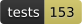

# vaelii-foreign

<!-- badges:start: regenerated by scripts/update-badges.sh (do not hand-edit) -->
[](LICENSE)
[](https://github.com/vaelii/vaelii-foreign/releases)
[](test)
[](src)
[](resources/vaelii/foreign.edn)
[](src/vaelii/foreign/cfasl.clj)
[](src)
<!-- badges:end -->

Foreign-format readers for [vaelii](https://github.com/vaelii/vaelii): the
formats the engine **reads and does not write**, kept out of the engine and picked up
from the classpath.

| kind | namespace | what it reads |
|------|-----------|---------------|
| `:cyc-corpus` | `vaelii.foreign.cyc` (+ `cfasl`, `units`, `cycl`) | an OpenCyc KB — the distribution's own binary CFASL dump directory, or a CycL text re-dump — [docs/opencyc.md](docs/opencyc.md) |
| `:rdf-graph` | `vaelii.foreign.rdf` (+ `turtle`, `rdfxml`) | RDF, RDFS and OWL as N-Triples, N-Quads, Turtle **or RDF/XML**: Wikidata, YAGO, DBpedia, schema.org, BFO, OpenCyc's OWL export, DOLCE — with the blank nodes RDF writes n-ary relations as read back as n-ary facts |
| `:wordnet-corpus` | `vaelii.foreign.wordnet` | a WordNet `dict/` directory — Princeton's WNDB files, and Open English WordNet's |
| `:obo-ontology` | `vaelii.foreign.obo` | an OBO-format ontology: the Gene Ontology, ChEBI, Uberon, and ~200 more |
| `:atomic-corpus` | `vaelii.foreign.atomic` | ATOMIC-2020, if-then commonsense — 1.3M defeasible tuples |

Each one is a **bridge**, finished the day its corpus has been converted once into the
format vaelii does write. That is why they ship here: a bridge in the engine is code that
must keep compiling, keep passing tests, and keep being read by whoever changes a record
shape, in exchange for nothing. Out here, retiring one is dropping a dependency.

**One corpus format, five converters** (`vaelii.foreign.corpus`). Each reader owns only
its own translation — what a term's role is, which axioms survive, what gets dropped and
why — and hands the result to one writer. So a directory any of them produced loads
through any of their `load-dir!`s, and vaelii's catalog opens one without being told what
made it. The four ontology readers are [docs/ontologies.md](docs/ontologies.md); OpenCyc
is a larger job and has its own account.

The reader for vaelii's own legacy record dialect (`:engine-dump`) plugs into the same
seam from `vaelii-legacy-import`, unreleased — a manifest merges with every other copy on
the classpath, so a private bridge composes with this one without either knowing about the
other.

## Using it

Add the dependency, and the engine finds the readers — Leiningen
`[com.vaelii/vaelii-foreign "0.5.1"]`, or deps.edn
`com.vaelii/vaelii-foreign {:mvn/version "0.5.1"}` — from
[Clojars](https://clojars.org/com.vaelii/vaelii-foreign). It depends on the engine at
the version it was cut with, so a project naming only this one gets both.

Nothing to require and nothing to call. `resources/vaelii/foreign.edn` declares
`kind -> reader var`; vaelii's seam (`vaelii.impl.foreign`) reads every copy of that
resource on the classpath, merges them, and resolves a symbol only when something asks
for that kind — so these namespaces load on demand and the engine holds no compile-time
reference to one. With the dependency in place, the catalog's `:corpus` kind loads a
translated corpus; without it, that refuses by name (`:type :no-foreign-reader`).

An embedding application that would rather wire it in code can call
`(vaelii.impl.foreign/register :cyc-corpus 'my.ns/reader)` instead of shipping a
manifest.

## The converter

Converting an ontology is a one-off, and it is the point of every reader here:

```sh
lein convert formats                                  # what can be read, and from what
lein convert convert <format> <source> <out-dir>      # write a corpus
lein convert load    <corpus-dir> <kb-dir> [--profile <name>]
lein convert report  <corpus-dir>                     # what converted, and what did not
lein convert diff    <corpus-dir> <corpus-dir>        # what one says and the other does not
```

`lein convert` runs with a heap that can hold a corpus; a plain `lein run` does not.
`diff` prints the comparison to read; `--edn` prints the map behind it too, to grep.

Which reader takes what, what a translation can and cannot preserve, and what each of
them drops by name is [docs/ontologies.md](docs/ontologies.md) for the four ontology
formats and [docs/opencyc.md](docs/opencyc.md) for OpenCyc. Each one carries the command
for its own format, so the rest of the converter is over there.

Every drop carries a **kind** as well as a reason, because the two are not the same
question: `:restated` and `:filtered` cost the corpus nothing, `:weakened` costs a
claim its strength, and only **`:unread`** is content the reader could not carry. That
is the number `report.edn` puts on its own line, and it is small: converting OpenCyc 4.0
lost 643 of its 1,889,842 assertions and its OWL export 1,784 of 2,281,726 triples, and
the OBO ontologies the suite converts lose nothing. The two OpenCyc figures come from one
run against a distribution this repo does not ship, not from anything it checks.

A **`:filtered` drop is one you can overrule**: `--obsolete`, `--editorial`,
`--code-rules`, `--empty-tails`, `--languages`. A reader with no flag for one owes a
sentence saying why none can exist, and a test walks the plugin manifest and refuses a
filtered drop that has neither, in both directions, so a flag nobody reads fails the
build too.

## Setup

```sh
lein test
```

The engine resolves from Clojars like any other dependency, so a fresh clone needs
nothing else.

The exception is working against an **unreleased** engine. If `project.clj` here names a
snapshot version of `com.vaelii/vaelii` — the development tree does, a release does not —
Clojars does not carry it, and it has to come out of `~/.m2`:

```sh
git clone https://github.com/vaelii/vaelii ../vaelii
cd ../vaelii && lein install
cd -          && lein test
```

Re-run `lein install` after an engine change you want the readers tested against — these
tests are integration tests against a real KB, and they reach into `vaelii.impl.*`, which
the engine is free to change. Carrying that cost is what a plugin is for.

`lein test` uses the space number 11 — one number names both of a KB's stores — and
clears it, so the engine's own suite (which owns 14 and 15) can run at the same time,
disk included. `VAELII_TEST_SPACE` moves it; `VAELII_TEST_BACKEND=disk` runs the readers
against the durable store, which for a corpus load is the interesting half.

Every fixture under `test/resources` is hand-authored — a reader is a capability, and its
checked-in test data is invented — except `cyc-tiny`, which is a vendored Apache-2.0 KB
dump ([licenses/THIRD-PARTY.md](licenses/THIRD-PARTY.md)).

Working against live engine source instead of the installed jar:

```sh
./scripts/link-checkouts.sh   # checkouts/vaelii -> the engine beside this repo
```

## Development

```
lein lint          → kondo + shellcheck + cljfmt + reflection, all of them, not fail-fast
lein fix           → the only auto-repair: cljfmt rewrites in place
lein gate          → lint, then the suite — run this before opening a pull request
lein test :offline → the suite without the tests that need a cached third-party corpus
lein test :suite   → only those — the W3C syntax suites and three real OBO ontologies
```

`:suite` and `:offline` split on what needs `scripts/fetch-suites.sh` to have been run.
A checkout that never runs it still runs everything else, which is why the fixtures under
`test/resources` are hand-authored; the suite tests print what they skipped and pass.

`lein lint` needs `clj-kondo` and `shellcheck` on PATH. The reflection stage
AOT-compiles `src` under `*warn-on-reflection*` and fails on any warning from this
repo's own code; the engine's namespaces load to satisfy a `require` and are scoped
out, since a reader out here can't repair core and shouldn't be blocked by it.

Badges come from `scripts/update-badges.sh`, which measures the repo and rewrites the
block under the H1. Don't hand-edit them.

## License

Apache-2.0 — see [LICENSE](LICENSE). The engine itself is SSPL; this artifact is part
of the permissive layer around it, which is also what its contents require: the CFASL
reader derives from Cycorp's own Apache-2.0 sources.

**A converted corpus carries its source's licence, not this repo's.** OpenCyc extends
the knowledge base's Apache-2.0 terms to "renamings and other logically equivalent
reformulations … in any formal language", which is exactly what a translation is; WordNet,
the OBO ontologies and ATOMIC each attach their own attribution terms the same way. So a
corpus travels with a notice whatever the converter is licensed under, and `convert!`
writes one into every corpus directory it creates. The full account, including which
upstream sources are and are not admissible here, is
[licenses/THIRD-PARTY.md](licenses/THIRD-PARTY.md).

Contributions: [CONTRIBUTING.md](CONTRIBUTING.md) (inbound = outbound, DCO sign-off, no
CLA).
